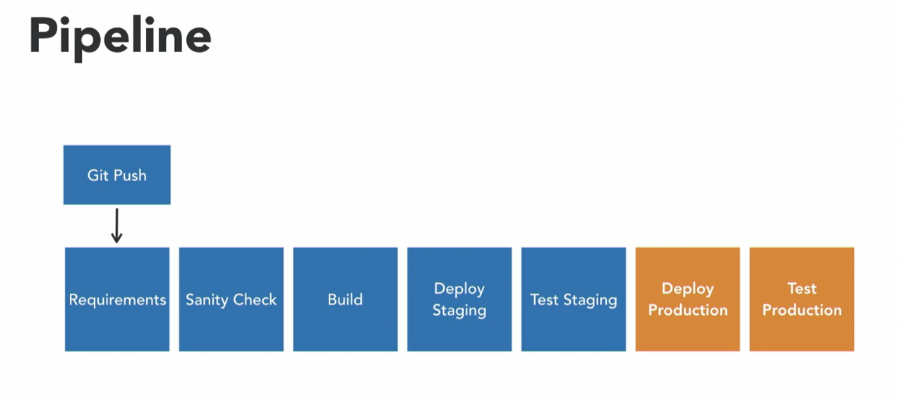

<!---
CI/CD process 
-->

## CI Tools

# Table of Contents
- [Table of Contents](#table-of-contents)
  - [1. Introduction ](#1-introduction-)
  - [2. Self-Hosted ](#2-self-hosted-)
  - [3. Cloud Service Providers ](#3-cloud-service-providers-)
  - [4. Codes Repositories ](#4-codes-repositories-)

## 1. Introduction 
* Building your CI/CD pipeline
* What you should know:
  * Application Development.
  * Scripting 
  * Source Code Management
  * CI/CD/CD
    * Continuous Integration
      * Developer work locally and commit to a shared repo
      * That code is integrated with other code.
      * The code is tested.
      * Faster than traditional development.
    * Continuous Delivery
      * Partner to continuous integration
      * Allow for building, testing, and delivery with every code change.
      * Testing of part of delivery minimizes bugs.
    * Continuous Deployment
      * Deployment that has done automatically, without human intervention
* Landscape of CI/CD tools and CI/CD tool categories
  * Self-hosted
  * SaaS-based CI/CD tools.
  * Cloud service providers
* The experimental CI/CD pipeline 
## 2. Self-Hosted 
* Jenkins:
  * Extended functionality with plugins
  * Blue Ocean plugin for pipeline UI
  * Configured in web UI or Jenskinsfile
  * Jenskinsfile is based on Groovy
  * See Ch01/01_01 folder
* Bamboo:
  * Work with Bitbucket
  * Have to pay depended on number of users and plugins.
  * Java format for configuration or web UI.
* TeamCity:
  * Tight integration with JetBrains IDEs
  * Work with other IDEs like Visual Studio
  * Free license with 100 builds and 3 build agents
  * Automatically configure jobs based on project code
  * We can configure it on configuration file or web UI.
  * Config files can be XML or Kotlin format.
* GoCD
  * Free and Open Source CD server.
  * Focus is on pipeline
  * Pipelines are make of stages, jobs, and tasks
  * We can configure it on configuration file or web UI.
  * Config files can be XML
  * Plugin support for JSON and YAML formats
  * 
## 3. Cloud Service Providers 

## 4. Codes Repositories 

